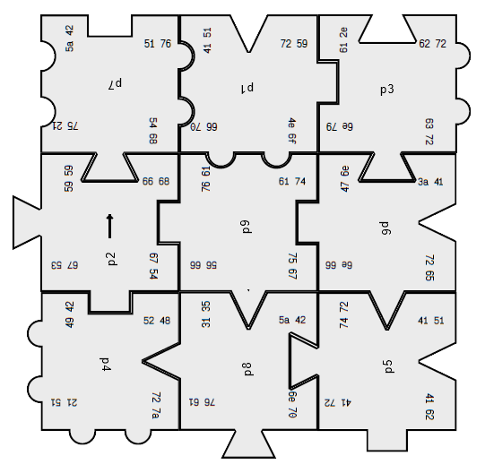

# Lösungsprogramm für Rätsel c't 15/2023

## Ausführung

Das Typescript Programm ```solve.ts``` kann mittels [node.js](https://nodejs.org/) ausgeführt werden:

```
> npx ts-node solve.ts
```

Oder noch besser mit [Deno](https://deno.com/runtime):

```
> deno run solve.ts
```

## Lösungsweg

### Teil 1: Lösen des Puzzles

1. Zuerst werden alle 9! = 362.880 Permutationen der Positionen der Puzzleteile
   gebildet.
2. Bei jeder Permutation drehen wir die einzelnen Puzzleteile bis alle Teile
   zusammenpassen.
3. Dazu fangen wir mit dem Teil links oben an und untersuchen alle vier rotierte
   Varianten. Ausgehend vom ersten Teil suchen wir alle passenden Rotationen des Teils
   rechts davon. Das selbe passiert rekursiv mit dem Teil danach. Erreichen wir das
   letzte Puzzleteil einer Zeile, dann machen wir mit dem linken Teil der nächsten Zeile
   weiter. In jedem Schritt wird geprüft, ob das Teil zu allen bisherigen Teilen passt.
4. Passt ein Teil in keiner rotierten Variante, dann brechen wir ab. Diese Permutation
   liefert uns also keine Lösung.
5. Am Ende werden vier Lösungen gefunden. Es handelt sich jedoch dabei jeweils um
   dieselbe Lösung, bei der das ganze Board gedreht ist.
   Wir beachten nur die Lösung, bei der der Pfeil das zweiten Teils nach oben zeigt:
   

### Teil 2: Lösen des Codes

1. Es werden nun jene Codes herangezogen, die richtig lesbare orientiert sind:
   ```
   51, 76, 72, 59, 62, 72, 66, 68, 61, 74, 3a, 41, 52, 48, 5a, 42, 41, 51
   ```
2. Es handelt sich um Hexadezimalzahlen, die per [ASCII Tabelle](https://de.wikipedia.org/wiki/American_Standard_Code_for_Information_Interchange) in einen Text umgewandelt werden können:
   ```
   QvrYbrfhat:ARHZBAQ
   ```
3. Letztendlich kann der Buchstabensalat per [ROT13-Algorithmus](https://en.wikipedia.org/wiki/ROT13) entschlüsselt werden:
   ```
   DieLoesung:NEUMOND
   ```

### Schwierigkeiten

In meinem ersten naiven Versuch habe ich für alle Permutationen alle möglichen Rotationen aller Teile ausprobiert. Dabei gibt es:

- Positions-Permutationen: 9! = 362.880
- Mögliche Rotationen: 4^9 = 262.144
- Kombinationen gesamt: 362.880 * 262.144 = 95.126.814.720

Es hat sich schnell herausgestellt, dass ich das Programmende dieses einfachen Algorithmus nie erleben werde. Die Lösung mit dem oben beschriebenen Algorithmus wurde dafür in knapp einer Sekunde gefunden.  Der Knackpunkt ist, dass man alle weiteren Möglichkeiten verwerfen kann, wenn zwei aneinanderliege Puzzleteile mit keiner Rotation zusammenpassen.

Das Entschlüsseln des Codes hat mich auch ein bisschen Zeit gekostet. Ich bin unterbewusst sofort davon ausgegangen, dass es sich um eine Bas64-Kodierung handelt (Berufskrankheit) - und habe in allen erdenklichen Richtungen die Codes zu lesen versucht. Zeilenwiese, Spaltenweise, im Uhrzeigersinn, etc. Erst nach einer Weile bin ich auf die
Idee gekommen auch andere Kodierungsmethoden, die in [CyberChef](https://gchq.github.io/CyberChef/#recipe=From_Hex('Auto')ROT13(true,true,false,13)&input=NTEgNzYgNzIgNTkgNjIgNzIgNjYgNjggNjEgNzQgM2EgNDEgNTIgNDggNWEgNDIgNDEgNTE)
zu finden sind, auszuprobieren.
